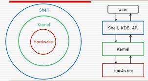

### Introdução ao terminal (Interface de linha de comando (CLI))
Executa o shell, programa que interpreta os comandos e os comunica ao kernel do sistema operacional, fazendo com que as ações pretendidas pelo usuário sejam implementadas no hardware. Chamamos de console o prompt de comando que está em um sistema sem interface gráfica, que não se abre em uma janela, como o terminal que utilizamos na máquina. O que chamamos de terminal, na verdade, é um simulador de terminal, pois se origina do terminal tradicional, composto por uma tela e um teclado sem um software de sistema.

O terminal pode ser uma ótima opção quando se quer mais agilidade e flexibilidade na hora de utilizar o computador, como por exemplo na hora de programar. Ao utilizar a interface da linha de comando se economiza tempo por se ter um ambiente sem muitas abstrações e pelos comandos que podemos executar de forma simplificada em comparação a navegação pela interface gráfica.

  

